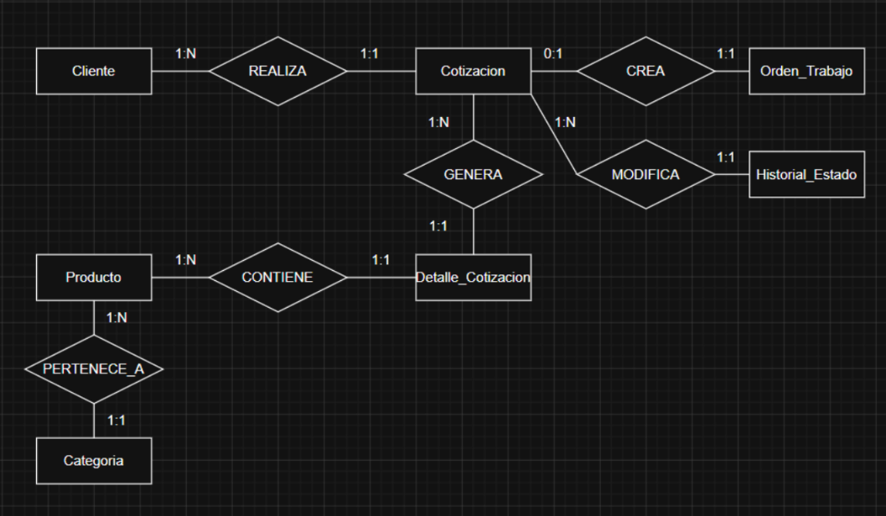

# Sistema de Cotización - Don Lucho

Proyecto final de Base de Datos  en **SQLite** para gestionar el proceso de cotización de productos en la empresa Don Lucho.

## Descripción

Este proyecto implementa una base de datos relacional para administrar clientes, categorías, productos, cotizaciones y órdenes de trabajo. El sistema utiliza restricciones de integridad, primary keys, foreign keys, vistas y triggers para garantizar la consistencia de la información y automatizar reglas de negocio.

---

## Estructura del proyecto

```
Sistema_Cotizacion_SQLite/
│
├── Sistema_Cotizacion_SQLite.db
├── ConsultasDB.txt
├── Trigger_y_prueba.txt
├── Vista_y_prueba.txt
└── README.md
```

| Archivo | Descripción |
|----------|-------------|
| Sistema_Cotizacion_SQLite.db | Script de creación de la base de datos. |
| ConsultasDB.txt | Consultas SQL para demostrar el funcionamiento del sistema. |
| Trigger_y_prueba.txt | Implementación y pruebas del trigger. |
| Vista_y_prueba.txt | Creación y pruebas de la vista. |

---

### Esquema Entidad-Relación

<div align="center">



</div>

## Modelo de datos

El sistema está conformado por las siguientes entidades:

- Cliente
- Categoría
- Producto
- Cotización
- Detalle_Cotización
- Orden_Trabajo
- Historial_Estado

### Relaciones principales

- Un cliente puede registrar varias cotizaciones.
- Una categoría puede contener múltiples productos.
- Una cotización puede incluir varios productos mediante la tabla `Detalle_Cotización`.
- Cada cotización puede generar una única orden de trabajo.
- Todos los cambios de estado de una cotización se registran en `Historial_Estado`.

---

## Tablas

## Esquema relacional

### Cliente

| Campo | Tipo | Llave | Restricciones |
|--------|------|:-----:|----------------|
| cliente_id | INTEGER | PK | AUTOINCREMENT |
| identificacion | TEXT | | NOT NULL, UNIQUE |
| nombre | TEXT | | NOT NULL |
| tipo_cliente | TEXT | | NOT NULL, CHECK ('Persona','Empresa','Institucion') |
| telefono | TEXT | | NOT NULL |
| correo | TEXT | | |
| direccion | TEXT | | |

---

### Categoria

| Campo | Tipo | Llave | Restricciones |
|--------|------|:-----:|----------------|
| categoria_id | INTEGER | PK | AUTOINCREMENT |
| nombre_categoria | TEXT | | NOT NULL, UNIQUE |
| descripcion | TEXT | | |

---

### Producto

| Campo | Tipo | Llave | Restricciones |
|--------|------|:-----:|----------------|
| producto_id | INTEGER | PK | AUTOINCREMENT |
| categoria_id | INTEGER | FK | NOT NULL, REFERENCES Categoria(categoria_id) |
| nombre_producto | TEXT | | NOT NULL |
| descripcion | TEXT | | |
| precio_base | REAL | | NOT NULL, CHECK(precio_base > 0) |
| stock_disponible | INTEGER | | NOT NULL, CHECK(stock_disponible >= 0) |
| activo | INTEGER | | NOT NULL, CHECK(activo IN (0,1)) |

---

### Cotizacion

| Campo | Tipo | Llave | Restricciones |
|--------|------|:-----:|----------------|
| cotizacion_id | INTEGER | PK | AUTOINCREMENT |
| cliente_id | INTEGER | FK | NOT NULL, REFERENCES Cliente(cliente_id) |
| fecha_creacion | TEXT | | NOT NULL |
| estado | TEXT | | NOT NULL, CHECK ('Pendiente','Aprobada','Rechazada','Finalizada') |
| descuento | REAL | | DEFAULT 0, CHECK(descuento >= 0) |
| observaciones | TEXT | | |
| total | REAL | | NOT NULL, CHECK(total >= 0) |

---

### Detalle_Cotizacion

| Campo | Tipo | Llave | Restricciones |
|--------|------|:-----:|----------------|
| detalle_id | INTEGER | PK | AUTOINCREMENT |
| cotizacion_id | INTEGER | FK | NOT NULL, REFERENCES Cotizacion(cotizacion_id) |
| producto_id | INTEGER | FK | NOT NULL, REFERENCES Producto(producto_id) |
| cantidad | INTEGER | | NOT NULL, CHECK(cantidad > 0) |
| precio_unitario | REAL | | NOT NULL, CHECK(precio_unitario > 0) |
| subtotal | REAL | | NOT NULL, CHECK(subtotal >= 0) |

---

### Orden_Trabajo

| Campo | Tipo | Llave | Restricciones |
|--------|------|:-----:|----------------|
| orden_id | INTEGER | PK | AUTOINCREMENT |
| cotizacion_id | INTEGER | FK | NOT NULL, UNIQUE, REFERENCES Cotizacion(cotizacion_id) |
| fecha_inicio | TEXT | | NOT NULL |
| fecha_entrega | TEXT | | NOT NULL |
| estado_produccion | TEXT | | NOT NULL, CHECK ('Pendiente','Produccion','Completada','Entregada') |

---

### Historial_Estado

| Campo | Tipo | Llave | Restricciones |
|--------|------|:-----:|----------------|
| historial_id | INTEGER | PK | AUTOINCREMENT |
| cotizacion_id | INTEGER | FK | NOT NULL, REFERENCES Cotizacion(cotizacion_id) |
| estado_anterior | TEXT | | NOT NULL |
| estado_nuevo | TEXT | | NOT NULL |
| fecha_cambio | TEXT | | NOT NULL |
---

## Restricciones implementadas

La base de datos utiliza distintos mecanismos para garantizar la integridad de la información:

- Claves primarias (`PRIMARY KEY`).
- Claves foráneas (`FOREIGN KEY`).
- Restricciones de unicidad (`UNIQUE`).
- Campos obligatorios (`NOT NULL`).
- Restricciones (`CHECK`).
- Valores por defecto (`DEFAULT`).

---

## Consultas

```
ConsultasDB.txt
```

- JOIN entre tablas.
- Funciones de agregación.
- Consultas con `GROUP BY`.
- Filtros con `WHERE` y `HAVING`.
- Ordenamientos.
- Subconsultas.

---

## Trigger

El proyecto implementa un trigger para automatizar una regla de negocio dentro de la base de datos. Su definición y prueba se encuentran en el archivo:

```
Trigger_y_prueba.txt
```

---

## Vista

Se creó una vista para simplificar consultas frecuentes que requieren información proveniente de varias tablas relacionadas.

La implementación y pruebas se encuentran en:

```
Vista_y_prueba.txt
```


---

## Justificación del modelo relacional

En este sistema, SQL relacional es la mejor opción porque la información depende de relaciones bien definidas entre clientes, cotizaciones, productos, categorías y órdenes de trabajo. Las claves primarias, claves foráneas y restricciones garantizan la integridad de los datos y permiten realizar consultas flexibles mediante JOIN.

Sin embargo, una lectura que sería menos eficiente en un modelo relacional sería consultar una cotización completa como un único documento con todos sus productos, cantidades y observaciones anidadas. Para obtener esa información es necesario unir varias tablas, como Cotizacion, Cliente, Detalle_Cotizacion, Producto y Categoria.

En un modelo documental, donde se podría usar MongoDB, toda la información de una cotización podría almacenarse dentro de un único documento con un arreglo de productos. Esto permitiría recuperar la cotización completa mediante una sola consulta, sin utilizar JOIN. El costo de ese enfoque sería una mayor duplicación de información y una menor capacidad para mantener la integridad referencial entre productos, categorías y clientes.
Por ello, para este proyecto se eligió el modelo relacional, ya que la prioridad es mantener reglas de integridad, evitar inconsistencias y facilitar consultas sobre datos relacionados.


---

## Autor

**Erick Sebastián Torres Suárez**

Código: **00334347**

Proyecto Final de Base de Datos
